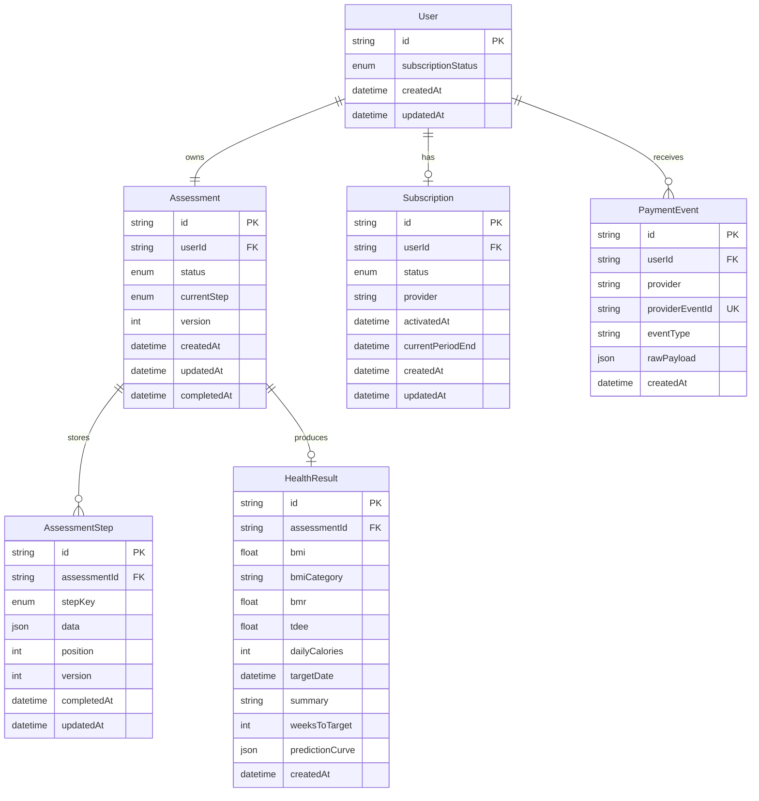

# 数据库 Schema 图

本项目使用 Prisma + PostgreSQL 建模健康测评 quiz funnel。核心目标是支持分步保存、进度恢复、服务端结果持久化、订阅鉴权和支付回调幂等。

## ER 图

## 表设计说明

### User

匿名用户/session 的根记录。`id` 可以由系统随机生成，也可以在 seed 中固定为 `demo_free_session`、`demo_paid_session`、`demo_pay_session`。

关键字段：

- `subscriptionStatus`：快速判断当前用户是否已付费。
- `assessment`：一对一关联当前测评。
- `subscription`：一对一关联当前订阅状态。
- `paymentEvents`：一对多记录支付回调事件。

### Assessment

一次健康测评的生命周期记录。

关键字段：

- `status`：`DRAFT`、`SUBMITTED`、`RESULT_READY`、`COMPLETED`。
- `currentStep`：记录当前进度。
- `version`：乐观锁版本号。每次分步保存成功后递增，旧 version 请求返回 409。
- `completedAt`：测评提交完成时间。

### AssessmentStep

每一步 quiz 的持久化记录。

关键字段：

- `stepKey`：`GENDER`、`GOALS`、`BODY`、`ACTIVITY`。
- `data`：JSON 字段，保存该 step 的增量数据。
- `position`：用于排序和恢复进度。
- `version`：step 级版本信息。

设计理由：

- 分步保存不把所有字段塞进 `Assessment` 大表。
- 后续新增 quiz step 时，只需要新增 stepKey/校验逻辑，不需要频繁改表结构。
- `@@unique([assessmentId, stepKey])` 保证同一步重复提交会更新原记录，不会产生重复 step。

### HealthResult

服务端健康算法生成的结果。

关键字段：

- `assessmentId`：唯一关联 assessment，重复 submit 不会创建多个 result。
- `bmi`、`bmiCategory`：非会员也可返回的基础结果。
- `bmr`、`tdee`、`dailyCalories`、`targetDate`、`predictionCurve`：完整计划字段，仅会员接口返回。
- `summary`：结果摘要。

### Subscription

模拟订阅记录。

关键字段：

- `status`：`FREE`、`ACTIVE`、`EXPIRED`、`CANCELED`。
- `activatedAt`：模拟支付成功时间。
- `currentPeriodEnd`：模拟订阅周期结束时间。

### PaymentEvent

模拟支付回调事件。

关键字段：

- `providerEventId`：对应 API 请求里的 `idempotencyKey`，设置唯一约束。
- `rawPayload`：保存支付回调原始数据，便于审计和排查。

设计理由：

- 相同 `idempotencyKey` 重复调用 `/pay` 不会重复创建事件。
- 不同 `idempotencyKey` 可以记录新的支付事件，但用户订阅状态仍保持 `ACTIVE`。

## 关系闭环

1. 用户进入 funnel 后创建 `User` 和 `Assessment`。
2. 每完成一步写入或更新 `AssessmentStep`，并递增 `Assessment.version`。
3. 用户提交完整测评后，服务端计算并 upsert `HealthResult`。
4. 结果页读取 `User.subscriptionStatus` 和 `HealthResult`。
5. 未付费用户只返回脱敏结果。
6. `/pay` 成功后更新 `User`、`Subscription`，并写入 `PaymentEvent`。
7. 再次读取结果时，`ACTIVE` 用户获得完整结果。
