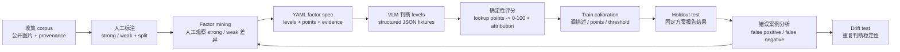

# Ad Intelligence Scorer

详细评估结果、错误案例和下一步计划见 [`reports/FINAL_REPORT.md`](reports/FINAL_REPORT.md)。README 主要保留项目入口、复现命令、阶段记录和文件说明。

这是一个面向 `phone_case` 的广告图片评分。

核心设计：

- VLM 只判断离散 factor level，例如 `product_prominence: hero`。
- YAML 表负责把 level 转成 points。
- Python 代码确定性计算 raw points、0-100 score 和 per-factor attribution。

我选择 `phone_case`，因为强弱样本差异比较清楚：强广告通常有使用场景、产品突出度和明确卖点；弱图常见于 marketplace listing，容易出现孤立产品、画面拥挤、卖点不清。

## Quickstart

无 API key 复现完整校准审计：

```powershell
py -m venv .venv; .\.venv\Scripts\python.exe -m pip install -e '.[dev]'
.\.venv\Scripts\python.exe scripts\run_fixture_calibration.py
```

单张 fixture 评分示例：

```powershell
.\.venv\Scripts\python.exe -m adint score fixture://strong --image-id strong_phone_case_001
```

测试和 spec 校验：

```powershell
.\.venv\Scripts\python.exe -m adint validate-spec
.\.venv\Scripts\python.exe -m pytest
```

## 本次提交完成了什么

第一阶段完成的是可运行 scaffold：

- CLI：`score`、`batch`、`calibrate`、`validate-spec`
- YAML factor table：`data/factors/phone_accessories_v0.yaml`，保存 v0 的 factor、level、points 和 evidence，是评分规则的可编辑数据表
- 确定性评分逻辑：level -> points -> normalized score
- Attribution 输出：每个 factor 的 level、points、rationale
- Judge providers：
  - `fixture`：读取缓存 judgments
  - `openai`：调用 OpenAI-compatible VLM，只输出 factor levels
- Starter data files：`corpus_manifest.csv` 用作图片主索引表，`labels.csv` 用作人工 strong/weak 标签表
- Fixture judgments：无 API key 可复现
- Test：验证 strong fixture 分数高于 weak fixture
- Report template 和 24 小时 workplan

第二阶段完成的是初始真实 corpus：

- 收集并保存 40 张 phone case 图片到 `data/images/`，作为本项目实际评分和校准使用的本地图片 corpus
- 数据分布：20 张 `strong`，20 张 `weak`
- 数据切分：30 张 `train`，10 张 `holdout`
  - `train`：开发/调参集，用来观察错误案例、调整 factor 定义、选择 threshold
  - `holdout`：最终测试集，只用于报告泛化结果；不应该用它来选择 threshold 或改 YAML
  - 当前数据量较小，因此没有再拆第三份独立 validation set；本项目用 `train` 承担 calibration/validation，用 `holdout` 承担 test
- 完成 `data/corpus_manifest.csv`，作为 corpus 主索引表：
  - 每张图包含 `source_url`、`brand`、`local_path`、`split`、`label`
- 完成 `data/labels/labels.csv`，作为人工 binary label 表：
  - 每张图包含人工 label 和简短 rationale
- 当前数据集已经通过完整性检查：
  - 无 TODO
  - 无缺失图片
  - manifest 和 labels 一一对应

第三阶段完成的是 factor mining：

- 新增 `data/factor_mining.csv`，用于保存每张图片的人工 factor-level gold labels，后续计算 Judge Agreement 时会和 VLM 输出逐项对比
  - 每张图片按 8 个 factor 做人工 level 标注，包括 v1 新增的 `marketplace_listing_signal`
  - level 使用 YAML 中的同一套离散值
  - `marketplace_listing_signal` 由人工直接查看 strong / weak contact sheet 后标注，40/40 样本无缺失；分布为 19 `campaign_like`、18 `generic_listing`、3 `ambiguous`
- 新增 `scripts/summarize_factor_mining.py`，用于统计人工 factor labels 在 strong / weak 样本中的分布
  - 这些统计用于判断每个 factor 是否真的能区分 strong / weak，而不是只凭主观感觉保留
- 更新 `data/factors/phone_accessories_v0.yaml`，用于把 seed factor spec 替换成有 corpus evidence 支撑的 v0 规则表
  - 将 seed evidence 替换成 corpus v0 的人工观察计数
  - 诚实标注弱分离 factor，例如 `product_prominence` 和 `material_and_detail`

第四阶段：VLM judgment 生成与失败案例处理：

- 新增 `scripts/generate_judgment_fixtures.py`，用于批量调用 VLM 生成结构化 judgment fixtures
  - 从 `data/corpus_manifest.csv` 这个 corpus 主索引表批量读取真实图片
  - 调用 VLM 只生成 factor-level judgments
  - 将结果缓存到 `fixtures/judgments/`，方便后续无 API key 复现
- 已完成 40 张真实 corpus 的 judgment fixtures
- 校准指标解释：
  - `strong_mean`：人工标为 strong 的图片平均分，越高说明强广告更容易被系统识别为高潜力。
  - `weak_mean`：人工标为 weak 的图片平均分，越低说明普通商品图 / 弱广告越不容易被误判为好广告。
  - `mean_gap`：`strong_mean - weak_mean`，衡量 strong 和 weak 的平均分距；越大越好。
  - `pairwise_separation`：随机取一张 strong 和一张 weak，strong 分数高于 weak 的比例；0.5 接近随机，越接近 1 越好。
  - `threshold_50_accuracy`：用固定阈值 50 做二分类的准确率；score >= 50 判为 strong，否则判为 weak。
  - `train-selected threshold`：只在 train/calibration split 上选出的最佳阈值，然后固定到 holdout/test 上评估，避免用测试集调参。
  - `Judge Agreement`：VLM 输出的 factor level 和人工 factor label 的 exact-match 比例，用来检查 VLM 是否真的能稳定判断每个 factor。
- 完成第一轮 v0 批量评分和校准：
  - `strong_mean`: 74.4
  - `weak_mean`: 63.0
  - `mean_gap`: 11.4
  - `pairwise_separation`: 0.665
  - `threshold_50_accuracy`: 0.525
- 修复一个批处理失败案例：
  - 现象：运行 VLM judgment 生成时，接口返回 `invalid_image_format`
  - 触发样本：`strong_case_011.jpg`
  - 根因：文件扩展名是 `.jpg`，但真实图片格式是 AVIF；原实现按文件名推断 MIME type，导致不支持的图片被直接上传
  - 修复：上传前用 Pillow 读取真实图片，统一转成 RGB JPEG data URL，并限制最长边，降低批量 judging 的格式风险
  - 经验：真实广告图片 corpus 不能只信文件扩展名，VLM batch 前需要做输入格式标准化
- 第一轮评分错误案例：
  - 证据来源：`reports/calibration_metrics.csv` / `reports/judge_agreement.csv` 提供汇总指标；运行 `scripts/run_fixture_calibration.py` 会重新生成 `outputs/predictions.csv`，用于查看逐样本 label / score / raw_points；`fixtures/judgments/*.json` 提供 VLM 输出的 factor levels 和 rationale。
  - `weak_case_012` / `weak_case_013`: 人工标签为 `weak`，但 v0 score = 100，raw_points = 42。两个 fixture 都输出 `hero`、`in_use`、`specific`、`clean`、`tactile`、`credible`、`high`，刚好对应当前 YAML 满分组合 `8+7+7+6+5+4+5=42`。rationale 中明确提到 being held / MagSafe feature / Apple logo，因此判断依据不是主观猜测，而是 VLM 将这些视觉线索映射成了高分 factor。
  - `weak_case_002`: 人工标签为 `weak`，但 v0 score = 89，raw_points = 34。fixture 输出 `hero`、`in_use`、`specific`、`clean`、`adequate`、`none`、`high`，其中 rationale 包含 “single dominant focal point”、“realistic use moment”、“travel or organization” 和 “clear subject boundaries”。这说明干净商品图被多个正向 factor 同时加分，需要加入 marketplace/listing 风格的惩罚或降低这些 factor 的单独影响。
  - `strong_case_011`: 人工标签为 `strong`，但 v0 score = 34，raw_points = -8。fixture 输出 `present`、`isolated`、`absent`、`busy`、`adequate`、`none`、`medium`，rationale 包含 “without a clear use context”、“No specific buyer benefit” 和 “no visible trust signals”。这说明 VLM 低估了偏 campaign 陈列的强样本，需要在后续校准中区分“品牌 campaign 陈列”和“普通电商 listing”。
  - `strong_case_001`: 人工标签为 `strong`，但 v0 score = 36，raw_points = -7。fixture 输出 `present`、`isolated`、`absent`、`busy`、`adequate`、`subtle`、`medium`，rationale 包含 “competes with other elements”、“without a clear use case” 和 “No specific buyer benefit”。这提示当前 factor 对广告来源/品牌语境没有利用，只看单图时会低估部分来自广告库的素材。
- 新增 focal-like calibration 诊断：
  - `scripts/tune_factor_weights.py` 用于做权重敏感性诊断：它使用类似 focal loss 的目标函数，默认给 `weak` 样本更高权重，用来重点观察 false positive weak cases。
  - 该脚本只输出建议权重变化，不自动改 YAML；原因是当前样本量小，直接优化 points 容易过拟合。
  - 第一轮诊断显示：仅靠调整现有 7 个 factor 的 points 不能稳定解决 weak 高分问题，更合理的下一步是新增或强化 `marketplace/listing` 风格惩罚 factor。

第五阶段 v1 修复记录：
  - 新增 `data/factors/phone_accessories_v1.yaml`，用于保存收紧后的 v1 factor spec 和 marketplace/listing 惩罚规则
  - 在 v0 的 7 个 factor 基础上增加 `marketplace_listing_signal`，用于区分真实 campaign/ad idea 和普通电商 listing / catalog shot
  - v1 judgments 单独保存到 `fixtures/judgments_v1/`，作为 v1 的 VLM 输出缓存，避免覆盖 v0 baseline
  - CLI 新增 `--fixture-dir` 参数，用来切换读取 `fixtures/judgments/` 还是 `fixtures/judgments_v1/`，从而分别评估 v0 和 v1
  - v1 首轮全量 40 张结果：
    - `strong_mean`: 77.75
    - `weak_mean`: 60.15
    - `mean_gap`: 17.6
    - `pairwise_separation`: 0.700
    - `threshold_50_accuracy`: 0.650
  - v1 首轮相比 v0 的变化：
    - `weak_mean`: 63.0 -> 60.15，下降 2.85
    - `mean_gap`: 11.4 -> 17.6，提升 6.2
    - `threshold_50_accuracy`: 0.525 -> 0.650，提升 0.125
    - `pairwise_separation`: 0.665 -> 0.700，略有提升
  - v1 首轮问题：
    - `weak_case_012`: v0 100 -> v1 100，`marketplace_listing_signal=campaign_like`
    - `weak_case_013`: v0 100 -> v1 100，`marketplace_listing_signal=campaign_like`
    - `weak_case_002`: v0 89 -> v1 96，`marketplace_listing_signal=campaign_like`
    - `weak_case_016`: v0 78 -> v1 100，`marketplace_listing_signal=campaign_like`
    - 证据显示首轮 `campaign_like` 定义太宽，把 hand-held / lifestyle-looking product shot / clean product presentation 误当成 campaign intent
  - 收紧动作：
    - 收紧 `marketplace_listing_signal` 的 `campaign_like` 定义：必须有明确 ad copy / benefit claim / brand-owned campaign context / launch-editorial presentation / benefit-linked lifestyle story
    - 明确排除：单纯手持、MagSafe ring、Apple/device logo、clean background、professionally photographed product shot
    - 扩大 `generic_listing` 定义：包含 generic hero image、compatibility/feature demo、product-page lifestyle shot with little narrative
  - 重连 API 后，已用收紧后的 spec 重新生成 40 张 v1 judgments 并完成校准。
  - v1 收紧版全量 40 张结果：
    - `strong_mean`: 77.1
    - `weak_mean`: 54.0
    - `mean_gap`: 23.1
    - `pairwise_separation`: 0.780
    - `threshold_50_accuracy`: 0.650
  - v1 收紧版相比 v0 的变化：
    - `weak_mean`: 63.0 -> 54.0，下降 9.0
    - `mean_gap`: 11.4 -> 23.1，提升 11.7
    - `threshold_50_accuracy`: 0.525 -> 0.650，提升 0.125
    - `pairwise_separation`: 0.665 -> 0.780，提升 0.115
  - v1 收紧版相比 v1 首轮的变化：
    - `weak_mean`: 60.15 -> 54.0，继续下降 6.15
    - `mean_gap`: 17.6 -> 23.1，继续提升 5.5
    - `pairwise_separation`: 0.700 -> 0.780，继续提升 0.080
    - `threshold_50_accuracy`: 0.650 -> 0.650，保持不变
  统计补充部分:最后一次提交中的的内容
  新增内容（1）
  - Calibration audit：
    - 新增 `scripts/evaluate_calibration.py`，用于统一输出 full / train / holdout 指标、best threshold、factor-level judge agreement
    - 新增 `reports/train_holdout_protocol.csv`，用于把 train-selected threshold 在 holdout/test 上的 accuracy、precision、recall、F1、FP/FN 单独保存成表格，方便评审者直接检查 calibration 是否严格
    - 新增 `reports/confusion_matrix.csv`，用于输出 train-selected threshold 下的 train / holdout 混淆矩阵，直接展示 weak/strong 分别被判成哪一类
    - 新增 `reports/CALIBRATION_TABLES.md` 和 `reports/calibration_metrics.csv`，用于把 before/after 指标整理成 GitHub 可读表格和可下载 CSV

    - Judge Agreement 定义：把 `data/factor_mining.csv` 中的人工 factor levels 当作 gold labels，与 VLM fixture 中同名 factor 的 level 做 exact-match comparison；也可以传入只人工复核过一部分样本的 CSV 子集
    - 人工标注覆盖：当前 `data/factor_mining.csv` 已覆盖 40/40 图片。v1 新增的 `marketplace_listing_signal` 来自人工看图复核，其中 strong 为 19 `campaign_like`、1 `generic_listing`；weak 为 17 `generic_listing`、3 `ambiguous`
    - 做法：`scripts/evaluate_calibration.py` 读取 v0/v1 predictions 和人工 labels；先在 `train` 上选择 threshold，再把该 threshold 固定到 `holdout/test` 上评估；最后由 `scripts/export_report_tables.py` 导出 Markdown / CSV 报告表格
    - 结果：
    - v1 train-selected threshold = 54，train accuracy = 0.800，train F1 = 0.800
    - v1 holdout/test at train threshold：accuracy = 0.700，precision = 0.625，recall = 1.000，F1 = 0.769，false positives = 3，false negatives = 0
    - v1 holdout/test confusion matrix：5 张 strong 全部预测为 strong；5 张 weak 中 2 张预测为 weak、3 张误判为 strong
    - holdout diagnostic：`strong_mean` 84.0, `weak_mean` 58.8, `mean_gap` 25.2, `pairwise_separation` 0.880；holdout best threshold = 59 / accuracy = 0.900 只作为诊断，不作为调参依据
    - VLM vs manual factor mining agreement：v0 = 196/280 = 0.700；v1 = 227/320 = 0.709。v1 的分母更大，因为加入了第 8 个人工标注 factor
    - v1 agreement 较高的 factors：`use_case_context` 0.850，`product_prominence` 0.800，`contrast_and_legibility` 0.775，`marketplace_listing_signal` 0.725
    - v1 agreement 较低的 factor：`brand_trust_signal` 0.425，说明 trust/logo 类判断主观性强，后续应改写定义或降低权重
    - 结果说明：v1 的全量 `mean_gap` 从 11.4 提升到 23.1，`pairwise_separation` 从 0.665 提升到 0.780，说明收紧后的 factor spec 明显扩大了 strong / weak 分数间隔；但 holdout precision = 0.625、false positives = 3，说明 polished weak listing 仍然是主要失败类型
  - v1 收紧版有效的部分：
    - 17/20 weak 被 `marketplace_listing_signal` 判为 `generic_listing`，3/20 weak 判为 `ambiguous`
    - 14/20 strong 被判为 `campaign_like`，3/20 strong 判为 `ambiguous`，3/20 strong 判为 `generic_listing`
    - `weak_case_002` 从 v0 89 降到 v1 49，说明收紧后的 listing factor 能修复部分 high-scoring weak listing
    - 整体上说明新增 factor 方向有效，明显扩大 strong / weak 的平均分差


  - v1 收紧后错误分析：
    - 证据来源：`reports/calibration_metrics.csv` / `reports/train_holdout_protocol.csv` 提供 v1 指标；运行 `scripts/run_fixture_calibration.py` 会重新生成 `outputs/predictions_v1.csv`，用于查看逐样本 score / raw_points；`fixtures/judgments_v1/*.json` 提供新增 factor 的 level 和 rationale。以下结论都有可复现文件支持，不是主观看图猜测。
    - 主要失败模式：整体指标改善，但仍有部分 polished weak 图片得分过高。收紧后的 `marketplace_listing_signal` 已不再把这些样本判成 `campaign_like`，但其他正向 factors 仍会把它们推高。
    - 证据表：

      | Case | Label | v0 score | v1 score | v1 raw | `marketplace_listing_signal` | VLM rationale evidence |
      | --- | --- | ---: | ---: | ---: | --- | --- |
      | `weak_case_012` | weak | 100 | 96 | 42 | `ambiguous` | “polished but lacks clear ad copy or narrative context” |
      | `weak_case_013` | weak | 100 | 96 | 42 | `ambiguous` | “polished but lacks explicit ad copy or narrative” |
      | `weak_case_002` | weak | 89 | 49 | 0 | `generic_listing` | “marketplace listing, catalog shot, or sales-page asset” |
      | `weak_case_016` | weak | 78 | 96 | 42 | `ambiguous` | “polished but lacks clear campaign context” |
      | `strong_case_011` | strong | 34 | 29 | -18 | `generic_listing` | “product display without campaign context” |

    - 从证据表推导出的结论：
      - `weak_case_002` 被成功修复：v1 将它判为 `generic_listing`，score 从 89 降到 49。
      - `weak_case_012` / `weak_case_013` / `weak_case_016` 不再被判为 `campaign_like`，但仍得 96，说明这些样本的高分主要来自 `hero`、`in_use`、`specific`、`clean`、`tactile`、`high` 等其他正向 factors；下一轮需要降低 polished product shot 在这些 factor 上的叠加收益，或新增 interaction penalty。
      - `strong_case_011` 从 34 降到 29，且新增 factor 给了 `generic_listing`，说明它是一个边界 false negative：人工标成 strong，但单图视觉上更像 product display。
  - 缓存与限流说明：
    - 当前 v0 的 40 张 judgments 已完整缓存于 `fixtures/judgments/`。
    - 收紧后的 v1 40 张 judgments 已完整缓存于 `fixtures/judgments_v1/`，并用于上述 v1 指标和错误分析。
    - 生成过程中曾遇到 GitHub Models rate limit，脚本因此增加了 `--start-at`、`--max-retries` 和 `--retry-sleep`，后续可以从失败样本继续覆盖生成。
    - 当前评分结果是可复现的 fixture-based baseline，不需要评审者拥有 API key 才能复跑 scoring / calibration。


第六阶段 drift test：
  - 新增 `scripts/run_drift_test.py`，用于对同一张图重复调用 VLM，观察 factor level 和 score 是否漂移
  - 使用 `data/factors/phone_accessories_v1.yaml` 作为 drift test 的评分规则
  - 选取 1 张 strong 和 1 张 weak，各重复 VLM judgment 10 次
  - 输出缓存到 `outputs/drift_test.json`
  - 测试结果：

    | Image | Label | Runs | Score min | Score max | Changed factors | Interpretation |
    | --- | --- | ---: | ---: | ---: | --- | --- |
    | `strong_case_003` | strong | 10 | 100 | 100 | none | 所有 factor level 完全一致，强广告样本稳定。 |
    | `weak_case_002` | weak | 10 | 29 | 49 | `contrast_and_legibility`, `product_prominence`, `visual_hierarchy` | 核心 listing 判断稳定，`marketplace_listing_signal=generic_listing` 10/10 一致；分数波动来自主体显著性、视觉层级和对比度判断。 |

  - Drift 可视化：

    ```mermaid
    xychart-beta
      title "Drift test score range"
      x-axis ["strong_case_003", "weak_case_002"]
      y-axis "Score" 0 --> 100
      bar "score_min" [100, 29]
      bar "score_max" [100, 49]
    ```

    ```mermaid
    pie showData
      title weak_case_002 product_prominence levels across 10 runs
      "hero" : 9
      "present" : 1
    ```

  - Drift 结论：
    - 对明确 strong 样本，factor-level 判断稳定，score 无漂移。
    - 对边界 weak 样本，核心 listing 判断稳定，但 `product_prominence`、`visual_hierarchy`、`contrast_and_legibility` 这类视觉边界 factor 会有轻微漂移。
    - 实际产品中应缓存 VLM judgments，并对接近阈值或有 changed factors 的样本做复核，而不是只依赖单次 live judgment 的分数。

第七阶段：from deficit to fix agent 设计：

- 输入：当前 scorer 的 per-factor attribution，例如 `benefit_clarity=absent`、`marketplace_listing_signal=generic_listing`、`contrast_and_legibility=medium`
- 生成 brief：只把低分 factor 转成改图指令，不把总分暴露给生成模型
  - `benefit_clarity` 低：补一个具体 buyer benefit，例如 drop protection / MagSafe strength / slim profile
  - `marketplace_listing_signal=generic_listing`：把普通商品陈列改成 campaign idea，例如 launch banner、benefit-linked lifestyle scene、brand-owned copy
  - `visual_hierarchy` 低：减少装饰元素，明确 product -> benefit copy -> CTA 的视觉顺序
  - `contrast_and_legibility` 低：提高移动 feed 下的主体边界和文字可读性
- 验证方式：不让同一个生成 agent 给自己打分。先用固定 fixture/scoring pipeline 做 predicted improvement，再用 holdout-like 人工 pairwise preference 或另一个 pinned VLM judge 做 verified improvement；只有两者都改善才算真正 better。

## 可视化报告表格

- `reports/CALIBRATION_TABLES.md`：GitHub 可直接阅读的校准总表，集中展示 before/after 指标、train -> holdout protocol 和 Judge Agreement。
- `reports/calibration_metrics.csv`：v0/v1 在 all / train / holdout 三个 split 上的核心指标表，用于比较收紧前后的分离效果。
- `reports/train_holdout_protocol.csv`：记录只在 train 上选出的 threshold，并把它固定到 holdout/test 后的 accuracy、precision、recall、F1、FP/FN。
- `reports/confusion_matrix.csv`：记录 train-selected threshold 下的 train / holdout 混淆矩阵，用于直接查看 false positives 和 false negatives 来自哪里。
- `reports/judge_agreement.csv`：记录 VLM factor levels 与人工 factor gold labels 的一致率，用来判断模型是否真的识别了可复核的视觉 factor。
- `reports/DRIFT_TEST_TABLE.md`：GitHub 可直接阅读的 drift test 表格，展示重复调用 VLM 后 score 和 factor level 是否漂移。
- `reports/drift_test_summary.csv`：每个 drift case 的分数范围、变化 factor 和稳定性摘要。
- `reports/drift_test_runs.csv`：drift test 每一次重复运行的完整明细，用于追溯是哪一个 factor 发生了变化。

## AI 工具使用

- AI 主要用于搭建 Python CLI、生成 factor spec 初稿、整理错误案例和改写 README。
- 我保留人工决策的部分：strong/weak 标签、`marketplace_listing_signal` 人工 gold labels、错误案例解释、是否接受 YAML 改动。
- 我不完全信任 VLM 的地方：它容易把 Apple logo、MagSafe 圆环、手持商品图和干净商品摄影误当成强广告信号；因此这些被写入 v1 factor 定义的排除条件，并用 fixtures 固化复现。

## With One More Week

- 扩到 400+ 张图片，并保留独立 validation / test，而不是当前小样本下的 train-calibration + holdout-test。
- 加 pairwise preference 标签，避免只靠 binary strong/weak。
- 给主要指标加 bootstrap confidence interval，避免 10 张 holdout 被单个样本影响过大。
- 做 factor ablation，确认哪些 factor 真有增益，哪些只是噪声。
- 扩大 drift test 到更多边界样本和至少两个 VLM provider。
- 把 deficit-to-fix agent 做成生成 brief 的真实命令，并用人工 pairwise 或离线 A/B 数据验证改图是否真的更好。

## 工作流程

1. **收集 corpus**  
   收集 40-80 张公开图片，记录到 `data/corpus_manifest.csv` 这个 corpus 主索引表。每张图保留 `source_url`（公开来源链接）、`label`（人工 strong/weak 标签）、`split`（train 或 holdout/test）、`brand`（品牌/平台来源）、`local_path`（本地图片路径）和备注。保留约 25-30% 作为 holdout/test。

2. **先标注，再调分**  
   标签写入 `data/labels/labels.csv`。第一版使用 `strong` / `weak` 二分类，必要时为模糊样本补充 pairwise preference。

3. **挖掘 factors**  
   当前 YAML 是 seed spec。真实数据收集后，比较 strong / weak 的视觉差异，并把 evidence 写进 YAML，例如 `use context: 19/30 strong vs 6/30 weak`。

4. **VLM 判断 levels**  
   VLM 只输出结构化 levels、confidence 和 rationale，不输出最终分数。使用 `scripts/generate_judgment_fixtures.py` 将 judgments 缓存到 `fixtures/judgments/`，保证无 key 复现。

5. **确定性评分**  
   代码读取 YAML 和 judgments，查表得到 points，汇总并 normalize 到 0-100，同时输出 attribution。

6. **校准和错误分析**  
   在 train 上调 points、描述和 threshold，在 holdout/test 上报告固定方案的结果。最终报告至少包含 before/after metrics、3 个 error cases、drift 结果和下一步计划。



## VLM 选择

默认选择：

```env
AI_ENDPOINT=https://models.github.ai/inference
AI_MODEL=openai/gpt-4o-mini
AI_API_KEY=your_token_here
```

选择 `gpt-4o-mini` 的原因：

- 支持图片输入
- 成本和速度适合 40-80 张图的批量 judging
- 对 factor-level JSON 输出足够稳定

如果时间允许，我会用更强的 VLM 抽样复核 ambiguous/error cases，而不是全量替换 primary judge。

## Live Scoring

复制 `.env.example` 为 `.env` 后，可以对真实图片评分：

```powershell
.\.venv\Scripts\python.exe -m adint score data\images\my_ad.jpg --provider openai --image-id my_ad
```

批量生成真实 corpus 的 VLM judgment fixtures，也就是把 VLM 对每张图的 factor-level 判断缓存成 JSON 文件：

```powershell
.\.venv\Scripts\python.exe scripts\generate_judgment_fixtures.py --limit 2
.\.venv\Scripts\python.exe scripts\generate_judgment_fixtures.py
```

生成后，用 fixture 路径批量评分和校准；这里不会再次调用 API，只读取已经缓存的 judgment JSON：

```powershell
.\.venv\Scripts\python.exe -m adint batch --provider fixture
.\.venv\Scripts\python.exe -m adint calibrate
```

查看 focal-like 权重调整建议，用来诊断哪些 false positive weak cases 对 points 调整最敏感：

```powershell
.\.venv\Scripts\python.exe scripts\tune_factor_weights.py
.\.venv\Scripts\python.exe scripts\tune_factor_weights.py --weak-alpha 5 --l2 0.001 --max-adjust 10
```

运行 calibration audit，生成 v0/v1 的 split metrics、train-selected threshold、Judge Agreement，并导出 GitHub 可读表格：

```powershell
.\.venv\Scripts\python.exe scripts\run_fixture_calibration.py
.\.venv\Scripts\python.exe scripts\evaluate_calibration.py
.\.venv\Scripts\python.exe scripts\evaluate_calibration.py --format table
.\.venv\Scripts\python.exe scripts\evaluate_calibration.py --factor-mining data\factor_mining.csv
.\.venv\Scripts\python.exe scripts\export_report_tables.py
```

运行 drift test，对同一张图重复 VLM judgment，观察 factor level 和 score 的稳定性：

```powershell
.\.venv\Scripts\python.exe scripts\run_drift_test.py --runs 10 --sleep 3
```

运行 v1 marketplace/listing 修复实验：

```powershell
.\.venv\Scripts\python.exe -m adint validate-spec --spec data\factors\phone_accessories_v1.yaml

.\.venv\Scripts\python.exe scripts\generate_judgment_fixtures.py `
  --spec data\factors\phone_accessories_v1.yaml `
  --out-dir fixtures\judgments_v1 `
  --limit 2

.\.venv\Scripts\python.exe scripts\generate_judgment_fixtures.py `
  --spec data\factors\phone_accessories_v1.yaml `
  --out-dir fixtures\judgments_v1 `
  --overwrite

.\.venv\Scripts\python.exe -m adint batch `
  --spec data\factors\phone_accessories_v1.yaml `
  --provider fixture `
  --fixture-dir fixtures\judgments_v1 `
  --out outputs\predictions_v1.csv

.\.venv\Scripts\python.exe -m adint calibrate --predictions outputs\predictions_v1.csv
```

注意：如果 `marketplace_listing_signal` 的文字定义发生变化，必须用 `--overwrite` 重新生成 `fixtures/judgments_v1/`，否则评分仍然基于旧 prompt 产生的 judgment。

如果生成中途遇到 GitHub Models rate limit，可以从失败的样本继续。例如失败在 `weak_case_003`：

```powershell
.\.venv\Scripts\python.exe scripts\generate_judgment_fixtures.py `
  --spec data\factors\phone_accessories_v1.yaml `
  --out-dir fixtures\judgments_v1 `
  --overwrite `
  --start-at weak_case_003 `
  --sleep 3 `
  --max-retries 6 `
  --retry-sleep 90
```

这里必须保留 `--overwrite`，因为 `fixtures/judgments_v1/` 中失败点之后可能还是旧 prompt 生成的文件。

## Repository Map

- `adint/`：项目核心代码目录，包含 CLI、judge provider、YAML spec loading、确定性 scoring 和 attribution 生成逻辑。
- `data/factors/phone_accessories_v0.yaml`：v0 factor table，用于定义 baseline 的 factor、level、points 和 evidence。
- `data/factors/phone_accessories_v1.yaml`：v1 factor table，用于保存收紧后的 marketplace/listing 惩罚规则。
- `data/factor_mining.csv`：人工 factor mining 结果，用于作为 Judge Agreement 的 gold labels。
- `data/corpus_manifest.csv`：corpus 主索引表，用于记录图片来源、split、label、品牌/平台和本地路径。
- `data/labels/labels.csv`：人工 strong/weak 标签表，用于最终 score separation 和分类指标计算。
- `fixtures/judgments/`：v0 VLM judgment 缓存目录，让评审者无 API key 也能复现 scoring。
- `fixtures/judgments_v1/`：v1 VLM judgment 缓存目录，用于评估收紧后的 factor spec，避免覆盖 v0 baseline。
- `reports/FINAL_REPORT.md`：最终中文报告，用于集中说明 calibration、error cases、drift test 和下一步计划。
- `reports/CALIBRATION_TABLES.md`：GitHub 可读的 calibration 表格，用于快速查看 before/after、holdout 和 agreement 结果。
- `reports/DRIFT_TEST_TABLE.md`：GitHub 可读的 drift test 表格，用于查看重复 VLM 判断的稳定性。
- `reports/*.csv`：可下载的结构化结果表，供面试官用表格工具查看 calibration、confusion matrix、Judge Agreement 和 drift 明细。
- `reports/REPORT_TEMPLATE.md`：报告模板，保留项目早期的报告结构草稿。
- `scripts/WORKPLAN.md`：24 小时执行计划，用于展示阶段安排和提交节奏。
- `scripts/evaluate_calibration.py`：校准审计脚本，用于汇总 split metrics、best threshold、train -> holdout protocol 和 factor-level agreement。
- `scripts/export_report_tables.py`：报告导出脚本，用于把 calibration / drift 结果写成 `reports/` 下的 Markdown 和 CSV。
- `scripts/generate_judgment_fixtures.py`：VLM judgment 生成脚本，用于批量把图片转换成结构化 factor-level JSON fixtures。
- `scripts/run_fixture_calibration.py`：无 API 复现脚本，用于从已缓存 fixtures 重新生成 v0/v1 predictions 并运行 calibration audit。
- `scripts/run_drift_test.py`：drift test 脚本，用于对同一图片重复调用 VLM 并记录 score / factor-level 漂移。
- `scripts/tune_factor_weights.py`：focal-like 权重诊断脚本，用于分析 weak false positives 对 factor points 调整的敏感性。
- `tests/`：自动化测试目录，用于验证评分逻辑和基础行为没有被后续改动破坏。

## 当前数据来源

当前 corpus 来自公开页面和公开广告/商品来源，包括：

- CASETiFY 官网
- OtterBox 官网
- PITAKA 官网
- KAPAVER 官网
- Meta Ad Library
- Amazon
- Taobao / Tmall
- JD
- eBay
- 1688

部分 Meta Ad Library 样本没有保留具体广告 URL，因此 manifest 中使用官方广告库首页并在 notes 中说明 provenance 限制。
