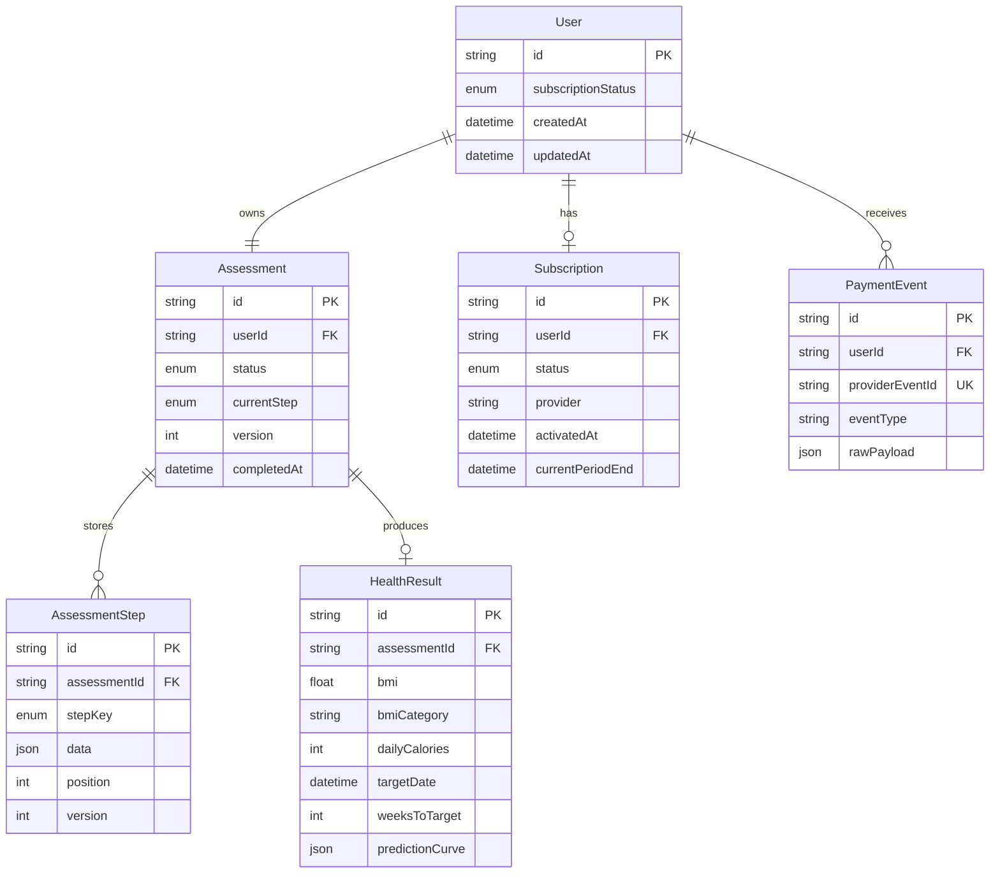

# 健康测评系统后端架构 Take-home

这是一个面向健康测评 funnel 的核心后端架构示例，包含可演示前端、Next.js API Routes、Prisma + PostgreSQL 数据模型、分步持久化、进度恢复、服务端健康评估、模拟订阅鉴权、支付回调闭环和自动化测试。

## 交付拆分

1. API 合同：定义专业的路径、方法、请求结构和响应结构。
2. 数据模型：使用 Prisma/PostgreSQL 建模 `User`、`Assessment`、`AssessmentStep`、`HealthResult`、`Subscription`、`PaymentEvent`。
3. 流程闭环：支持分步保存、进度恢复、提交计算、非会员脱敏、调用 `/pay` 后解锁完整结果。
4. 自动化质量：用 Vitest 覆盖算法边界、持久化恢复、乱序/重复/并发提交、鉴权差异和支付回调。
5. 交付说明：README 包含 API 文档、Schema 图、测试范围、部署方式和 AI 使用复盘。

## 快速启动

```bash
npm install
cp .env.example .env
npm run db:generate
npm run db:push
npm run db:seed
npm run dev
```

本地打开 `http://localhost:3000`，可以从头走完测评，先看到非会员脱敏结果，再点击模拟支付解锁完整结果。

本地开发如果没有配置 `DATABASE_URL`，服务会自动使用内存 store，方便先演示接口和前端流程；配置 PostgreSQL 后会走 Prisma 持久化。线上交付必须配置真实 `DATABASE_URL`。

一键质量验证：

```bash
npm run ci
```

## 本地调试记录

- 错误内容：PowerShell 中直接执行 `curl -X POST ...` 报 `Invoke-WebRequest` 参数错误；改用 `curl.exe` 后，`POST /api/v1/sessions` 返回 `INTERNAL_ERROR`，前端表现为选择后点击 Continue 无法继续。
- 排查过程：先确认 PowerShell 的 `curl` 是别名问题，再用 `curl.exe -i` 复现 500；检查 `.env` 后发现本地没有 `DATABASE_URL`，因此 Prisma 创建 session 时无法连接数据库。
- 修复方式：README 补充 PowerShell 可复制命令；后端在本地未配置 `DATABASE_URL` 时自动切换到内存 store；前端在 session 创建成功前禁用 Continue 并显示 `Starting...`。
- 使用工具：PowerShell、`curl.exe`、`Invoke-RestMethod`、`rg`、Next.js API 日志、Vitest、TypeScript typecheck。
- 最后结果：`POST /api/v1/sessions` 从 500 变为 `201 Created`；分步保存和进度恢复接口可用；`npm run typecheck` 与 `npm test -- tests/workflows.test.ts` 通过。

## 部署说明

推荐使用 Vercel + Supabase/Neon PostgreSQL。

```bash
npm run db:generate
npm run build
```

部署后需要配置环境变量：

```env
DATABASE_URL=postgresql://...
NEXT_PUBLIC_APP_URL=https://your-domain.example
```

线上初始化数据库：

```bash
npm run db:push
npm run db:seed
```

交付信息：

- 线上演示地址：`TODO: 部署到 Vercel 后填写`
- GitHub 仓库：`TODO: 提交仓库后填写`
- 已支付测试 sessionId：`demo_paid_session`
- 未支付测试 sessionId：`demo_free_session`

## API 文档

PowerShell 注意：Windows PowerShell 里的 `curl` 默认是 `Invoke-WebRequest` 别名，不是真正的 curl。要么写 `curl.exe`，要么直接使用 `Invoke-RestMethod`。

所有错误响应统一为：

```json
{
  "error": {
    "code": "VALIDATION_ERROR",
    "message": "Invalid assessment step payload",
    "details": {}
  }
}
```

### 创建 Session

`POST /api/v1/sessions`

PowerShell：

```powershell
$progress = Invoke-RestMethod -Method Post -Uri "http://localhost:3000/api/v1/sessions"
$sessionId = $progress.sessionId
$sessionId
```

curl.exe：

```powershell
curl.exe -X POST "http://localhost:3000/api/v1/sessions"
```

响应示例：

```json
{
  "sessionId": "clx...",
  "assessmentStatus": "DRAFT",
  "currentStep": null,
  "nextStep": "GENDER",
  "completedSteps": [],
  "version": 0,
  "draft": {}
}
```

### 分步保存

`PATCH /api/v1/sessions/{sessionId}/assessment-steps/{stepKey}`

`stepKey` 支持：`gender`、`goals`、`body`、`activity`。

请求示例：

PowerShell：

```powershell
$body = @{
  age = 35
  heightCm = 165
  weightKg = 73
  targetWeightKg = 64
} | ConvertTo-Json

Invoke-RestMethod `
  -Method Patch `
  -Uri "http://localhost:3000/api/v1/sessions/$sessionId/assessment-steps/body" `
  -ContentType "application/json" `
  -Body $body
```

curl.exe：

```powershell
curl.exe -X PATCH "http://localhost:3000/api/v1/sessions/$sessionId/assessment-steps/body" `
  -H "Content-Type: application/json" `
  --data-raw "{`"age`":35,`"heightCm`":165,`"weightKg`":73,`"targetWeightKg`":64}"
```

### 进度恢复

`GET /api/v1/sessions/{sessionId}/progress`

返回内容包括：已完成步骤、下一步、合并后的 draft 数据、当前版本号。

PowerShell：

```powershell
Invoke-RestMethod -Method Get -Uri "http://localhost:3000/api/v1/sessions/$sessionId/progress"
```

### 提交测评

`POST /api/v1/sessions/{sessionId}/assessment/submit`

提交后服务端会计算并持久化：

- BMI
- BMI 分类
- 建议每日摄入量
- 目标预测日期
- 按周生成的体重预测曲线

### 获取结果

`GET /api/v1/sessions/{sessionId}/results`

非会员只返回预览数据：

```json
{
  "access": "preview",
  "requiresPayment": true,
  "subscriptionStatus": "FREE",
  "result": {
    "bmi": 26.81,
    "bmiCategory": "overweight"
  },
  "paywall": {
    "message": "Upgrade to unlock your calorie target, goal date, and prediction curve.",
    "unlocks": ["dailyCalories", "targetDate", "weeksToTarget", "predictionCurve"]
  }
}
```

会员会返回完整结果，包含 `dailyCalories`、`targetDate`、`weeksToTarget`、`predictionCurve`。

### 模拟支付回调

题目要求的快捷接口：

```powershell
$payBody = @{
  sessionId = "demo_free_session"
  providerEventId = "manual_demo_free_session"
} | ConvertTo-Json

Invoke-RestMethod `
  -Method Post `
  -Uri "http://localhost:3000/pay" `
  -ContentType "application/json" `
  -Body $payBody
```

正式命名接口：

```powershell
Invoke-RestMethod `
  -Method Post `
  -Uri "http://localhost:3000/api/v1/payments/mock-callback" `
  -ContentType "application/json" `
  -Body $payBody
```

回调会把用户的 `subscriptionStatus` 改为 `ACTIVE`，并写入 `PaymentEvent`。重复提交相同 `providerEventId` 是幂等的。

## 数据模型



设计取舍：

- `AssessmentStep.data` 使用 JSONB，便于后续新增问卷步骤，避免频繁修改大表结构。
- `Assessment.version` 和 `AssessmentStep.version` 用于支持重复提交、恢复和并发更新的可观察性。
- `PaymentEvent.providerEventId` 唯一，保证支付回调幂等。
- `HealthResult.predictionCurve` 是受保护字段，非会员接口不会返回。

## 测试覆盖

运行测试：

```bash
npm test
```

当前覆盖范围：

- 健康评估算法：BMI、BMI 分类、摄入量、目标日期、预测曲线。
- 算法边界：缺失字段、非数字注入、身高/体重/年龄越界、目标体重过激、目标体重与减重目标矛盾。
- 持久化流程：分步保存、中断后恢复、乱序提交、重复提交、并发更新。
- 鉴权差异：非会员拿不到 `predictionCurve`、`dailyCalories`、`targetDate`。
- 支付闭环：`/pay` 等价回调后状态变为 `ACTIVE`，结果从 preview 变 full。
- 幂等性：重复支付事件不会破坏订阅状态。

暂未覆盖：

- 真实 PostgreSQL 集成测试：当前 CI 用内存 store 覆盖服务层行为，Prisma schema 和 migration 已提交。如果要验证数据库级锁和事务行为，可以在 CI 里增加 PostgreSQL service。
- 浏览器端 E2E：前端可以手动走通。如果交付时间允许，建议补 Playwright 覆盖从首页到支付弹窗的完整路径。

## CI

CI 接入建议执行内容：

```bash
npm ci
npm run db:generate
npm run typecheck
npm test
```

## 核心目录

- `app/`：Next.js App Router 前端和 API routes。
- `src/domain/`：类型、输入校验、健康评估算法。
- `src/server/`：Store 接口、Prisma store、Memory store、业务 workflow、HTTP 错误处理。
- `prisma/schema.prisma`：PostgreSQL 数据模型。
- `prisma/migrations/0001_init/migration.sql`：初始化迁移 SQL。
- `tests/`：Vitest 自动化测试。

## AI 使用复盘

我把 AI 和 Codex skills 当成架构、流程和测试搭档，而不是只当代码生成器：

- Funnel 解析：先使用 `funnel-analysis` skill 拆解 BetterMe Pilates 类健康测评项目的完整链路，不只看首屏，而是分析录入节奏、信任建立、结果页拦截、付费触发和恢复路径，再把这些观察转成当前项目的测评步骤、结果预览和模拟支付闭环。
- 项目流程设计：使用 `using-superpowers` skill 帮我把评分标准拆成工程执行清单，明确 API 设计、数据建模、分步持久化、订阅鉴权、测试覆盖、README 交付说明这些验收点，避免只做一个能跑的 demo。
- 数据建模：先让 AI 根据评分标准列出实体关系，再人工收敛为 `User -> Assessment -> AssessmentStep -> HealthResult` 和 `User -> Subscription/PaymentEvent`。最终保留 step JSONB，是为了兼顾问卷扩展性和分步恢复。
- Mock 数据：用 AI 生成了一组减重用户数据，再人工检查目标体重是否安全，最后固定成 `demo_free_session` 和 `demo_paid_session`。
- 复杂逻辑：健康算法由 AI 起草 BMI、Mifflin-St Jeor、活动系数、目标曲线，我人工加了安全下限和目标体重合理性约束。
- 测试用例：AI 帮我枚举边界场景，包括非数字注入、越界、重复支付、非会员字段泄露。我把这些变成 Vitest 用例，而不是只靠本地点页面。
- 否决的一次方案：AI 曾建议把所有问卷字段直接放在 `Assessment` 大表里。我否决了，因为评分标准强调扩展性和分步保存；大表方案会让新增步骤、重复提交版本、乱序恢复和审计都变差。因此最终使用 `AssessmentStep` 独立表保存每一步数据。
